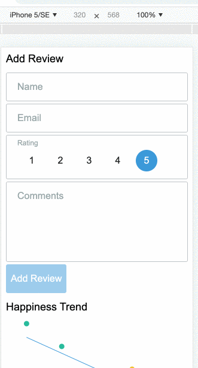

# Customer reviews

Simple customer reviews application with reviews trends chart

## Application architeture

This application is being build using following tech:

- [Parcel js](https://parceljs.org/)
- [react](https://redux.js.org/)
- [xstate](https://xstate.js.org/docs/)
- [emotion](https://emotion.sh/docs/introduction)
- [typescript](https://www.typescriptlang.org/)

Directory structure:

- **components** - Contains reusable UI components
- **modules** - Contains application business components split into modules
- **utils** - Contains small utility functions

## Installation

Make sure you have [nodejs](https://nodejs.org/en/) installed on your machine. From the project directory, run following:

### `npm install`

## Available Scripts

In the project directory, you can run:

### `npm start`

Runs the app in the development mode. 
Open [http://localhost:1234](http://localhost:1234) to view it in the browser.

The page will reload if you make edits. 
You will also see any lint errors in the console.

### `npm test`

Launches the test runner. Code coverage can be observed at `./test-coverage/lcov-report/index.html`
